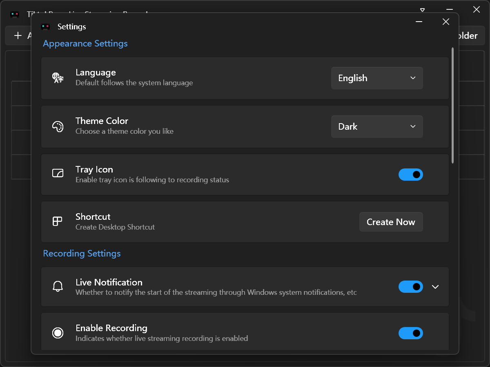

[English](README.md) | [简体中文](README.zh-Hans.md)


# Emerde

[](https://github.com/qzj1472/Emerde/blob/main/LICENSE) [](https://github.com/qzj1472/Emerde/actions/workflows/build.yml) [](https://dotnet.microsoft.com/en-us/download/dotnet/latest/runtime) [](https://github.com/qzj1472/Emerde/releases)
[](https://github.com/qzj1472/Emerde/releases)

With a graphical UI, unattended operation, and live streaming recording capabilities.

Based on FFmpeg and FFplay.

## Screen Shot



## Dependencies Runtime

[.NET Desktop Runtime 9.0 for Windows](https://dotnet.microsoft.com/en-us/download/dotnet/9.0)

## Live Streaming

Support following live site.

| Site            | Status    |
| --------------- | --------- |
| Douyin (抖音)   | Available |
| Tiktok          | Available |

How to add live room:

```bash
# Douyin room URL like following:
https://live.douyin.com/XXX
https://www.douyin.com/root/live/XXX

# Tiktok room URL like following:
https://www.tiktok.com/@XXX/live
```

## Support OS

This project only supports Windows.

| OS      | Framework | Status    |
| ------- | --------- | --------- |
| Windows | WPF       | Available |

## Project Structure

| Path | Purpose |
| ---- | ------- |
| `src/Emerde` | Windows WPF application |
| `build` | Windows packaging assets and scripts |
| `doc` | Cookie setup guides |
| `assets` | README images |
| `branding` | Product icons and branding assets |

## Your Cookie Can

Check it from [GETCOOKIE_DOUYIN.md](doc/GETCOOKIE_DOUYIN.md) or [GETCOOKIE_TIKTOK.md](doc/GETCOOKIE_TIKTOK.md).

## Privacy Policy

See the [Privacy Policy](PrivacyPolicy.md).

## License

This project is licensed under the [MIT License](LICENSE).

## Thanks

To save maintenance costs, refer to the specific string data form [DouyinLiveRecorder](https://github.com/ihmily/DouyinLiveRecorder), just like regex and so on.
