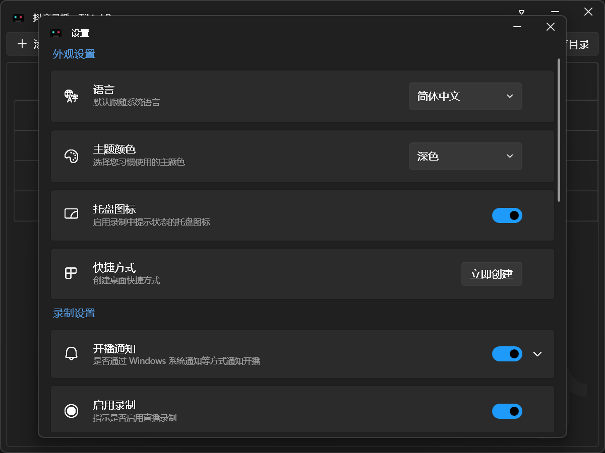

[English](README.md) | [简体中文](README.zh-Hans.md)


# 抖音直播录制

[](https://github.com/emako/TiktokLiveRec/blob/master/LICENSE) [](https://github.com/emako/TiktokLiveRec/actions/workflows/library.nuget.yml) [](https://dotnet.microsoft.com/en-us/download/dotnet/latest/runtime) [](https://github.com/emako/TiktokLiveRec/releases)
[](https://github.com/emako/TiktokLiveRec/releases)

具有用户界面、无人值守操作和直播流录制功能。

实现基于 FFmpeg 以及 FFplay。

## 截图



## 依赖运行时

[Windows .NET Desktop Runtime 9.0](https://dotnet.microsoft.com/en-us/download/dotnet/9.0)

## 直播录制

支持以下直播平台

| 平台              | 状态 |
| ----------------- | ---- |
| Douyin (中国抖音) | 支持 |
| Tiktok (海外抖音) | 支持 |

怎么添加直播间：

```bash
# 国内抖音直播间链接类似如下：
https://live.douyin.com/XXX
https://www.douyin.com/root/live/XXX

# 海外抖音直播间链接类似如下：
https://www.tiktok.com/@XXX/live
```

## 支持系统

本项目只支持 Windows。

| 操作系统 | 开发框架 | 状态 |
| -------- | -------- | ---- |
| Windows  | WPF      | 支持 |

## 项目结构

| 路径 | 用途 |
| ---- | ---- |
| `src/TiktokLiveRec` | Windows WPF 应用 |
| `build` | Windows 打包资源和脚本 |
| `doc` | Cookie 配置文档 |
| `assets` | README 图片 |
| `branding` | 产品图标和品牌资源 |

## 自有Cookie

来看看 [GETCOOKIE_DOUYIN.md](doc/GETCOOKIE_DOUYIN.md) 或 [GETCOOKIE_TIKTOK.md](doc/GETCOOKIE_TIKTOK.md)。

## 隐私政策

[查看隐私政策](PrivacyPolicy.zh-Hans.md)。

## 许可证

本项目基于 [MIT 许可证](LICENSE)。

## 鸣谢

为了节约后续维护成本，直接参考了部分来自 [DouyinLiveRecorder](https://github.com/ihmily/DouyinLiveRecorder) 的字符串数据比如正则表达式。
